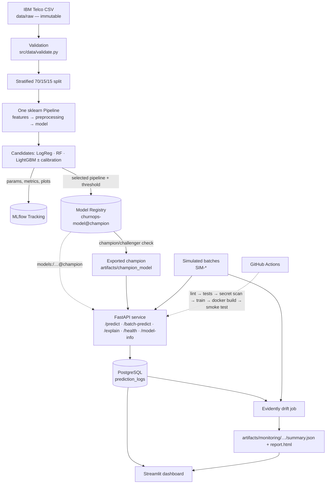

# ChurnOps — Production ML Churn Prediction Platform

An end-to-end machine-learning system that takes a telecom churn model from raw data
through experiment tracking, model registry, API serving, containerization, automated
testing, prediction logging and drift monitoring.


**Live API:** `<URL>/docs` · **Monitoring dashboard:** `<URL>`

> **Note:** The IBM Telco dataset is a cross-sectional sample dataset. The project models
> churn **risk** from a customer snapshot and uses **simulated** production batches to
> demonstrate monitoring; it does not claim real-time telecom production performance or
> time-bound forecasts such as "will churn in the next 30 days".

---

## Architecture



## Key capabilities

| Area | What is implemented |
| --- | --- |
| Data | Reproducible download, schema/category/range validation with explicit errors, raw data never modified |
| Modeling | One serializable pipeline (feature engineering + preprocessing + estimator), 8 candidates, calibration, cost-based threshold |
| MLOps | MLflow runs, artifacts, signature, registered versions, `champion` alias, champion/challenger promotion rule |
| Serving | FastAPI + Pydantic: raw business fields in, probability/class/risk band/model lineage out; single, JSON batch and CSV batch |
| Explainability | `/explain` returns per-prediction feature contributions (permutation SHAP on readable raw features) |
| Persistence | Every prediction logged with model version, threshold and request features (PostgreSQL / SQLite) |
| Monitoring | Evidently drift reports on 5 deterministic simulated scenarios or on logged API traffic |
| Observability | Streamlit dashboard: KPIs, probability histogram, risk bands, traffic over time, drift status |
| Quality | 72 tests (unit, pipeline, API contract, MLflow integration, monitoring), ruff, 85% coverage |
| Delivery | Docker image, docker-compose stack (Postgres + MLflow + API + dashboard), CI that retrains and smoke-tests the container |
| Security | No secrets in repo, env-based config, non-root containers, gitleaks scan, skops model loading with a type allowlist |

## Dataset and limitations

IBM Telco Customer Churn: 7,043 customers, 21 columns, binary `Churn` target (26.5% positive).
Source: [IBM GitHub archive](https://github.com/IBM/telco-customer-churn-on-icp4d) (also on Kaggle).

- **No time axis.** Splits are stratified random, not temporal backtests; the model outputs a risk score for a snapshot.
- **11 blank `TotalCharges`** — all have `tenure = 0` (never billed). They are kept and imputed inside the pipeline; the API accepts `TotalCharges: null` for the same case.
- **No delayed ground truth.** `actual_outcome` in the prediction log stays `NULL`; live performance monitoring is out of scope, only input/output drift is monitored.
- **Simulated monitoring.** Drift batches are resampled/perturbed held-out customers, tagged `SIM-*`.

Focused EDA: [`notebooks/01_eda.ipynb`](notebooks/01_eda.ipynb) (target rate, blank charges, churn by contract / internet / payment / support, leakage review).

## Modeling approach and results

**Protocol** (`src/training/train.py`): every candidate is fit on train (4,930 rows) and scored on validation (1,056).
The winner is the best validation PR-AUC; candidates within 0.005 of the best are tie-broken by Brier score, then simplicity.
The decision threshold minimises a *hypothetical* validation cost (FN = 5, FP = 1). Only then is the test set (1,057) used — once.

Validation comparison (`artifacts/training/model_comparison.csv`):

| Candidate | PR-AUC | ROC-AUC | Brier |
| --- | --- | --- | --- |
| **lightgbm_v2** (selected) | **0.649** | **0.852** | **0.133** |
| lightgbm_v2 + sigmoid calibration | 0.647 | 0.851 | 0.134 |
| lightgbm_v1 + sigmoid calibration | 0.636 | 0.845 | 0.136 |
| lightgbm_v1 | 0.636 | 0.845 | 0.136 |
| random_forest | 0.631 | 0.842 | 0.138 |
| logreg (baseline) | 0.630 | 0.845 | 0.137 |
| lightgbm_v3 | 0.627 | 0.837 | 0.141 |
| lightgbm_v3 + sigmoid calibration | 0.623 | 0.837 | 0.139 |

**Frozen test metrics** (selected pipeline, threshold 0.12):

| PR-AUC | ROC-AUC | Brier | Recall | Precision | F1 |
| --- | --- | --- | --- | --- | --- |
| 0.662 | 0.840 | 0.137 | 0.900 | 0.427 | 0.580 |

Honest reading: the gap between LightGBM and the logistic-regression baseline is small (≈0.02 PR-AUC on ~1k validation rows),
which is typical for this dataset. The engineering system, not the leaderboard, is the point of the project.
Calibration was already good, so the calibrated variants did not win — the calibration curve is in `artifacts/training/test_calibration.png`.

**Threshold vs. risk bands.** These are deliberately separate:

- `prediction` uses the cost-based threshold (0.12). With a 5:1 FN:FP cost, it is worth flagging customers at modest risk for a cheap retention action, so recall is high (0.90).
- `risk_level` is a UI label for prioritisation: low < 0.30 ≤ medium ≤ 0.60 < high. A customer at p = 0.2 is therefore `prediction = 1`, `risk_level = "low"`: *act, but lowest priority.*

Both are project assumptions and are returned by `/model-info`.

Evaluation artifacts (also logged to MLflow): confusion matrix, ROC/PR curves, calibration plot, SHAP summary, feature importance, `metrics.json`.

## MLflow

```bash
make train      # logs 8 candidate runs + 1 selected run, registers a new version of churnops-model
make promote    # moves alias `champion` if the new version is not worse; exports it to artifacts/champion_model
make mlflow-ui  # http://localhost:5000
```

The API loads `models:/churnops-model@champion` — never a hard-coded version or a loose `.pkl`.
The threshold, feature version and explanation background are stored as **model metadata**, so they are versioned with the model.

Models are serialized with **skops** (MLflow 3's default) rather than pickle, which only loads explicitly trusted types.
`src/training/serialization.py` computes the required types and refuses anything outside an allowlist (`sklearn`, `lightgbm`, `numpy`, `src.`).

<!-- Screenshots: docs/images/mlflow_runs.png, docs/images/mlflow_registry.png -->

## API

| Endpoint | Method | Purpose |
| --- | --- | --- |
| `/health` | GET | Readiness (`model_loaded`, DB status) |
| `/model-info` | GET | Model name, alias, version, URI, threshold, risk bands |
| `/predict` | POST | One customer |
| `/batch-predict` | POST | JSON `{"records": [...]}` (≤ `MAX_BATCH_SIZE`) |
| `/batch-predict/csv` | POST | CSV upload in the original dataset layout |
| `/explain` | POST | Top feature contributions for one customer |

```bash
curl -X POST localhost:8000/predict -H "Content-Type: application/json" -d '{
  "customerID": "DEMO-0001", "gender": "Female", "SeniorCitizen": 0, "Partner": "Yes",
  "Dependents": "No", "tenure": 8, "PhoneService": "Yes", "MultipleLines": "No",
  "InternetService": "Fiber optic", "OnlineSecurity": "No", "OnlineBackup": "No",
  "DeviceProtection": "Yes", "TechSupport": "No", "StreamingTV": "Yes", "StreamingMovies": "Yes",
  "Contract": "Month-to-month", "PaperlessBilling": "Yes", "PaymentMethod": "Electronic check",
  "MonthlyCharges": 89.55, "TotalCharges": 720.40}'
```

```json
{
  "prediction_id": "76087eea-96dc-456a-ab95-a1511b360e72",
  "customerID": "DEMO-0001",
  "prediction": 1,
  "churn_probability": 0.72921,
  "risk_level": "high",
  "threshold": 0.12,
  "model_name": "churnops-model",
  "model_alias": "champion",
  "model_version": "1",
  "logged": true
}
```

`/explain` for the same customer (probability units; contributions sum to the prediction):

```json
{
  "churn_probability": 0.72921, "base_value": 0.281076,
  "top_increasing": [
    {"feature": "tenure", "value": 8, "contribution": 0.158},
    {"feature": "Contract", "value": "Month-to-month", "contribution": 0.099},
    {"feature": "InternetService", "value": "Fiber optic", "contribution": 0.060}
  ],
  "top_decreasing": [{"feature": "MultipleLines", "value": "No", "contribution": -0.033}],
  "note": "Contributions describe how the model used each feature for this prediction. They are not causal effects."
}
```

**Validation behaviour** (all tested): negative numbers, out-of-range values, unknown categories, extra fields and
inconsistent service combinations (e.g. `OnlineSecurity="Yes"` with `InternetService="No"`) return **422**.
Unknown categories are rejected at the API boundary on purpose; the encoder's `handle_unknown="ignore"` is only a second line of defence.

**Operational choices:**
- The champion is loaded once at startup; startup **fails fast** if it cannot be loaded.
- If the prediction-log write fails, the prediction is still returned with `"logged": false` and an error is logged (availability over log completeness).
- Every response carries `X-Process-Time-Ms`. Observed locally: ~15 ms per single prediction after warm-up; ~50 ms for `/explain`. These are local measurements, not an SLA.
- Logs are JSON lines.

<!-- Screenshot: docs/images/swagger.png -->

## Monitoring (simulated)

```bash
make simulate          # 5 deterministic SIM-* batches from the held-out test split
make drift             # Evidently report per scenario → artifacts/monitoring/YYYY-MM-DD/<run>/
make simulate-traffic  # send the batches through the running API (fills the prediction log)
make drift-db          # drift on the last 500 logged requests
```

| Scenario | Simulation | Drifted features (of 19) | Avg churn prob. |
| --- | --- | --- | --- |
| baseline | plain resample | **0** (sanity check) | 0.255 |
| pricing_shift | MonthlyCharges +15–25% | 1 — MonthlyCharges | 0.250 |
| contract_mix | 6× weight on month-to-month | 8 — Contract, tenure, TotalCharges, … | 0.376 |
| maturity_shift | 8× weight on tenure ≤ 12 | 12 — tenure, TotalCharges, MonthlyCharges, … | 0.400 |
| channel_shift | 6× weight on electronic check | 11 — PaymentMethod, tenure, … | 0.374 |

Resampling on one attribute also shifts **correlated** attributes (new customers are more often month-to-month,
electronic-check payers skew to fiber, etc.), which is why the resampling scenarios flag several features.
The pricing scenario perturbs values directly, so only the targeted feature drifts.
Drift direction is method-aware: Evidently uses distance metrics on large samples and p-value tests on small ones.

<!-- Screenshots: docs/images/dashboard.png, docs/images/evidently.png -->

## Local setup

### Docker (recommended)

```bash
cp .env.example .env         # set POSTGRES_PASSWORD
docker compose up --build    # API :8000/docs · dashboard :8501 · MLflow :5000
```

The API image contains the exported champion (`artifacts/champion_model`, committed to the repo) so it runs without a registry.
To serve straight from the registry: `make train-remote` (trains against the compose MLflow server), then set
`MODEL_URI=models:/churnops-model@champion` in `.env` and restart the API.

### Python

```bash
python -m venv .venv && source .venv/bin/activate   # Windows: .\.venv\Scripts\Activate.ps1
pip install -r requirements.txt
make all        # data → baseline → train → promote → simulate → drift → test
make api        # http://localhost:8000/docs
make dashboard  # http://localhost:8501
```

Without `make` (e.g. plain PowerShell), each target is a one-liner in the [Makefile](Makefile), e.g.
`python -m src.training.train` then `python -m src.training.register`.

Everything is reproducible: `random_state=42` everywhere; a clean clone reproduces the metrics above exactly.

## Testing and CI

```bash
make test       # 72 tests, coverage report
make test-fast  # skip integration tests
make lint
```

| Layer | Examples |
| --- | --- |
| Unit | validation errors, TotalCharges conversion, engineered features, risk bands, cost threshold, schemas |
| Pipeline | stratified disjoint split, finite transformed inputs, no ID/target leakage, unknown-category handling |
| API | health, model-info, predict, 422 cases, batch order/count, CSV upload, log row fields, log-failure policy, explain |
| Integration | log → register → alias → load by alias → predict; exported-model load; fail-fast; skops allowlist; champion/challenger promotion; drift artifact |

Tests use synthetic, schema-valid data, so CI needs no dataset for them. The CI **container** job then downloads the
real data, retrains (`--quick`), promotes, builds the image, starts it and checks `/health` and `/predict`.

## Deployment

Pick one platform and finish it (e.g. Render). Minimum setup:

1. **PostgreSQL**: create a managed instance; copy its connection string.
2. **API** (Docker web service from this repo, `Dockerfile`): set `DATABASE_URL=postgresql+psycopg2://…`. The platform's `PORT` is honoured. Health check path: `/health`.
3. **Dashboard** (second web service, `Dockerfile.dashboard`): set `DATABASE_URL` (same DB) and `API_URL` (the API's public URL).
4. Secrets only in the platform's environment settings.

MLflow compromise (documented on purpose): hosting a registry on a free tier is costly, so full tracking and the registry
run in local/docker-compose development, and the promoted champion is exported into the deployment image with its lineage
(model name, alias, version) in the model metadata. `/model-info` shows exactly which registered version is serving.

## Project structure

```
app/                 FastAPI service (schemas, model service, DB, routes)
src/
  config.py          single source of truth for the feature contract and paths
  risk.py            risk band labels
  data/              download, validate, split
  features/build.py  FeatureEngineer + preprocessing + pipeline factory
  training/          baseline, train, evaluate, register (promotion + export), serialization
  monitoring/        simulated batch generator, Evidently drift job
dashboard/app.py     Streamlit monitoring UI (read-only)
notebooks/01_eda.ipynb
tests/               unit / api / integration
artifacts/           champion model, training reports, drift summaries (committed); HTML reports (ignored)
Dockerfile, Dockerfile.dashboard, docker-compose.yml, Makefile, .github/workflows/ci.yml
```

## Future work

- Scheduled monitoring and retraining (Prefect) with automatic challenger evaluation
- Performance monitoring once delayed labels exist (`actual_outcome`)
- Bootstrap confidence intervals for model comparison
- Prometheus metrics, load testing (Locust/k6), OpenTelemetry tracing
- DVC or object storage for data and model artifacts
