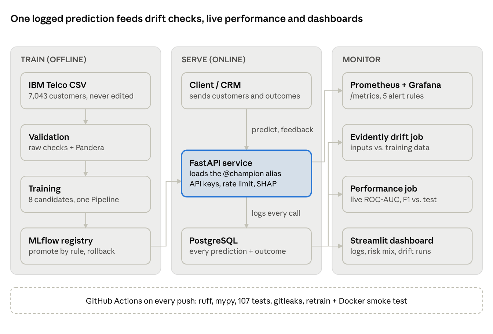
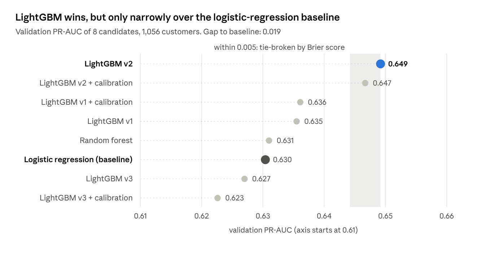
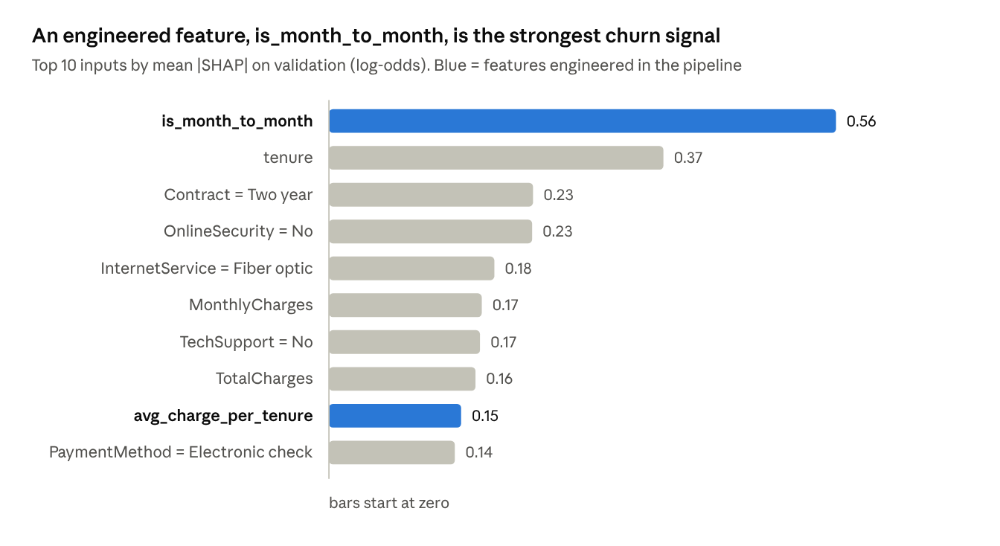
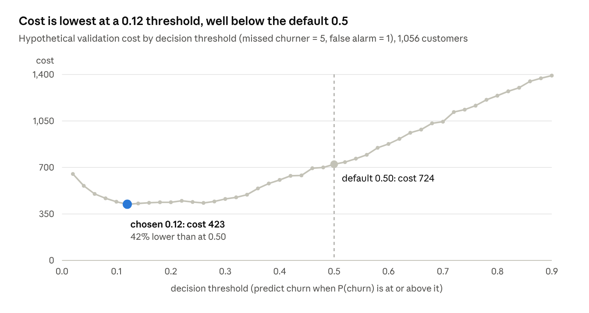
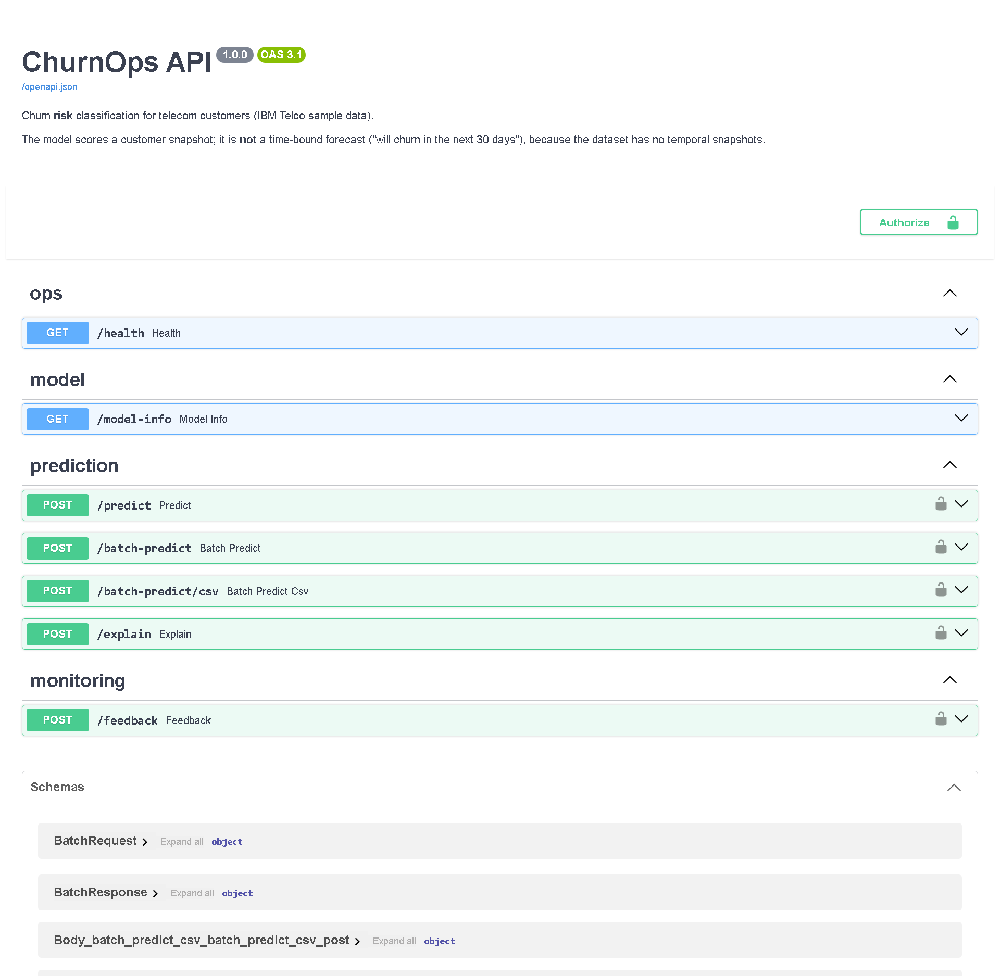
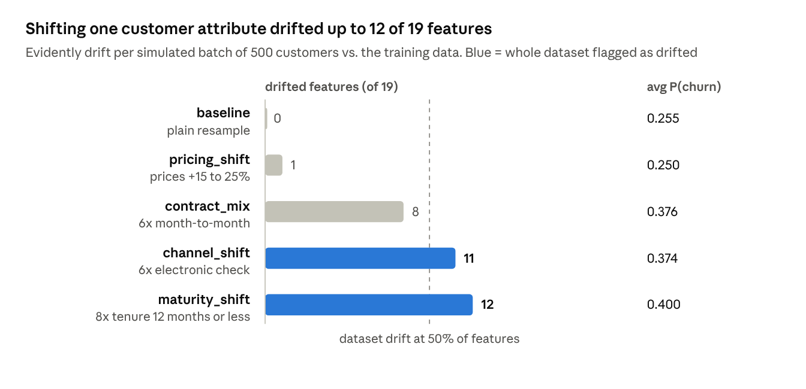
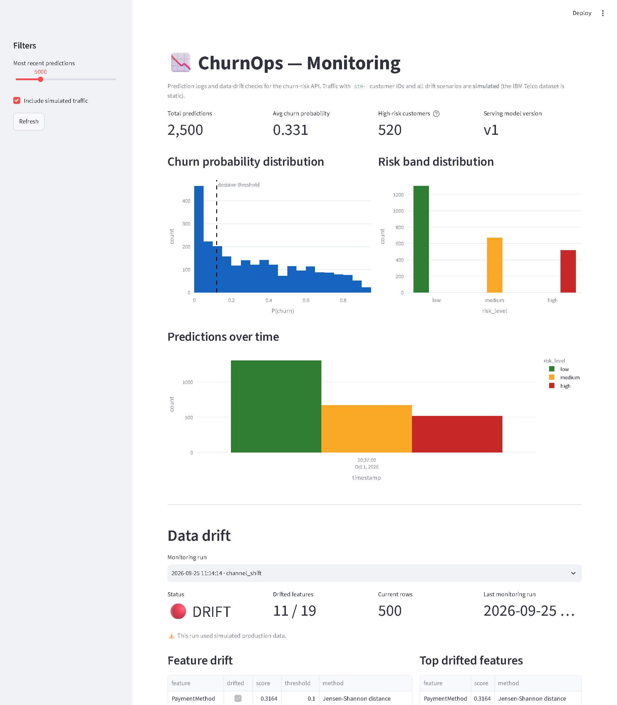
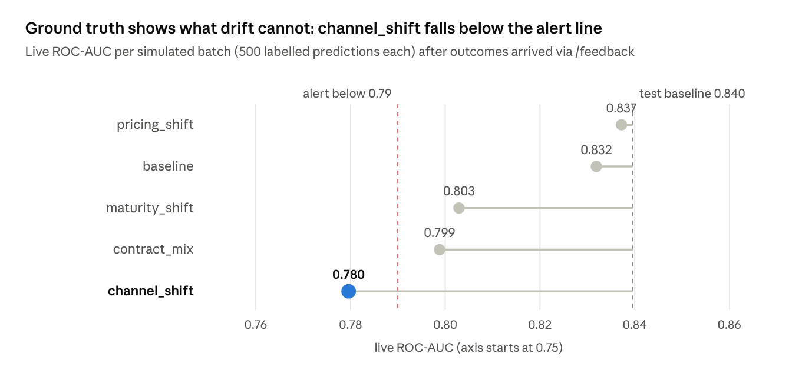

# From Notebook to Production: Building ChurnOps, an End-to-End MLOps Platform for Churn Prediction

*A churn model is easy. A churn model you can deploy, monitor, roll back and trust is the real project. Here is how I built one end to end, what broke along the way, and what each piece taught me.*

Most churn-prediction tutorials end the moment a notebook prints a ROC-AUC. In a real company that is where the work starts. Someone has to serve the model, log what it predicted, notice when customers start looking different, find out whether the model is still right, and put the old version back when a new one misbehaves.

I built **ChurnOps** to practise exactly that part. It takes the IBM Telco churn dataset (7,043 customers, 26.5% churners) from a raw CSV to a monitored production-style service:

- one scikit-learn pipeline, chosen from 8 candidates and tracked in **MLflow**
- a **FastAPI** service with input contracts, explanations, API keys and rate limiting
- every prediction logged to **PostgreSQL**
- drift reports with **Evidently** and a ground-truth feedback loop for live ROC-AUC and F1
- **Prometheus** metrics, a **Grafana** dashboard and alert rules
- 107 tests, type checks and a CI pipeline that retrains the model and smoke-tests the Docker image

The model itself is deliberately ordinary. LightGBM beats a logistic-regression baseline by only about 0.02 PR-AUC, and I say so openly. The engineering around the model is the point.

The full code is on GitHub: [QuietLess/churnops-production-ml](https://github.com/QuietLess/churnops-production-ml).

One honesty note before we start: the dataset is a single snapshot with no time axis. So the model scores churn **risk** for a customer today. It does not forecast "will churn in the next 30 days", and all production traffic in this article is simulated and labelled as such.

## The architecture at a glance



The system has three lanes. Training runs offline and ends in an MLflow registry. Serving loads whichever version holds the `champion` alias and logs every call. Monitoring reads that log, so drift checks, live performance and dashboards all look at exactly what the API served. Everything runs locally with one command, `docker compose up`: PostgreSQL, MLflow, the API, the dashboard, Prometheus and Grafana.

## 1. Data you can trust: two layers of validation

Bad data should stop the pipeline loudly, not quietly train a worse model. ChurnOps checks data twice.

**Layer 1: the raw file.** `src/data/validate.py` checks the CSV exactly as downloaded: the expected 21 columns, unique customer IDs, a Yes/No target, only known category values, no negative charges. Every failure raises a readable `DataValidationError` instead of a bare `assert`. The raw file is never modified, so any result can be reproduced from scratch.

This layer found the dataset's one real quirk. `TotalCharges` is a text column with 11 blank values. Every one of those customers has `tenure = 0`: they joined this month and have never been billed. So they are not errors to drop. They are kept, imputed inside the pipeline, and the API accepts `TotalCharges: null` for brand-new customers.

**Layer 2: typed contracts between stages.** After cleaning, a declarative [Pandera](https://pandera.readthedocs.io/) schema guards every DataFrame that moves through the system: the training table before the split, and every scoring or drift batch. It checks types, ranges, allowed categories and two cross-column rules:

- internet add-ons say "No internet service" exactly when `InternetService` is "No"
- `MultipleLines` says "No phone service" exactly when `PhoneService` is "No"

The schema is generated from the same feature contract the API uses, so a new category is added in one place. Validation is lazy, so all problems come back in one message:

```text
churn_training_table failed 4 check(s):
  <row>: internet add-ons inconsistent with InternetService -> 1 row(s), rows [2]
  customerID: field_uniqueness -> 2 row(s), e.g. 'C00004', rows [3, 4]
  tenure: greater_than_or_equal_to(0) -> 1 row(s), e.g. -3, rows [0]
  Contract: isin(['Month-to-month', 'One year', 'Two year']) -> 1 row(s), e.g. 'Weekly', rows [1]
```

The split is then a stratified 70/15/15: 4,930 training rows, 1,056 for validation and 1,057 for test. The test set is touched exactly once, at the very end.

## 2. Modeling: one pipeline, eight candidates, an honest winner

The most useful modeling decision was structural, not algorithmic: **feature engineering, preprocessing and the estimator are one scikit-learn `Pipeline`, saved as a single object.** The API sends raw business fields (`Contract`, `tenure`, `PaymentMethod`) and the pipeline does the rest. Serving can never preprocess differently from training, because it runs the same code.

The pipeline adds four engineered features (`service_count`, `avg_charge_per_tenure`, `is_month_to_month`, `has_support`), imputes, scales where it helps and one-hot encodes. `customerID` is dropped inside the pipeline, so it can never leak into the model.

Eight candidates compete: logistic regression as the baseline, a random forest, and three LightGBM settings, each with and without sigmoid calibration. All hyperparameters live in `configs/config.yaml`, not in the code. The selection rule is written down before looking at results:

1. Best validation **PR-AUC** wins. With 26.5% positives, PR-AUC says more about finding churners than accuracy or ROC-AUC.
2. Candidates within 0.005 of the best are tie-broken by **Brier score** (better calibrated probabilities), then by simplicity.
3. Only the winner ever sees the test set, once.



The winner scored **PR-AUC 0.662, ROC-AUC 0.840 and Brier 0.137** on the frozen test set. The gap to logistic regression is about 0.02 on roughly 1,000 rows, which is small and typical for this dataset. The calibrated variants did not win because the raw model was already well calibrated.



SHAP agrees with business intuition: month-to-month contracts, short tenure, fiber internet and no online security or tech support push churn risk up. Two of the top ten signals are features I engineered, which is a good argument for spending time on features before tuning.

## 3. A threshold chosen by cost, not by habit

The default 0.5 threshold is a habit, not a decision. In churn, missing a customer who leaves is usually far more expensive than offering a discount to one who would have stayed. ChurnOps assumes a missed churner costs 5 units and a false alarm costs 1 (a stated assumption, not real telecom economics) and picks the threshold with the lowest total cost on the validation set.



On the untouched test set, 0.5 would catch 49% of churners. The chosen 0.12 catches 90% of them, at a precision of 43%: worth it when the action is a cheap retention offer.

**Threshold and risk bands are separate on purpose.** `prediction` answers "should we act?" using the cost threshold. `risk_level` answers "how urgently?" with fixed bands: low below 0.30, high above 0.60, medium between. A customer at p = 0.20 is therefore `prediction = 1, risk_level = "low"`: act, but last. Both settings are returned by `/model-info`, so nobody has to guess how a label was made.

### What 0.12 means for a retention team

Metrics like recall are abstract. Here is the same decision as a retention manager would see it, on the 1,057 held-out test customers, of whom 281 actually churned:

| | Threshold 0.50 | Threshold 0.12 |
| --- | --- | --- |
| Customers flagged for an offer | 207 | 592 |
| Churners caught | 138 of 281 (49%) | 253 of 281 (90%) |
| Churners missed | 143 | 28 |
| Offers sent to customers who would have stayed | 69 | 339 |
| Total cost (missed churner = 5, false alarm = 1) | 784 | 479 |

Moving to 0.12 means sending 385 more offers in exchange for catching 115 more churners. Whether that trade is worth it depends on two numbers only the business knows: the value of a retained customer and the cost of an offer. That is why the cost ratio sits in a config file instead of being buried in code. If the real ratio is 3:1 or 10:1, you change one line and retrain, and the threshold moves with it.

The risk bands then help the team work through the list. Of the 592 flagged customers, the highest-risk ones get a phone call first; the low-risk ones get an email.

## 4. MLflow: champion, challenger and a way back

Every candidate run is logged to MLflow with its parameters, validation metrics and fit time. The selected pipeline is then logged once more with its test metrics, plots, a signature and an input example, and registered as a new version of `churnops-model`.

Three details matter more than the UI screenshots:

1. **The API never loads a file path.** It loads `models:/churnops-model@champion`, an alias. Promoting a model means moving the alias, not redeploying code.
2. **Decision settings travel with the model.** The threshold, risk bands, feature version and the background rows used for explanations are stored as model metadata. A new model version can never be served with an old threshold.
3. **No pickle.** Models are saved with [skops](https://skops.readthedocs.io/), which only loads an explicit allowlist of types (`sklearn`, `lightgbm`, `numpy` and the project's own `src.` classes). A tampered model file fails to load instead of running arbitrary code.

**Promotion is a rule, not a click.** `make promote` moves the `champion` alias to the newest version only if its validation PR-AUC is not lower than the current champion's. Otherwise the old champion keeps serving and a warning explains why.

**Rollback is one command.** Every promotion tags the new champion with `previous_champion=<old version>`. If the new model misbehaves in production:

```bash
make rollback   # alias goes back to the version it replaced, and it is re-exported
```

Running it again walks one more step back through the history. The demoted version is tagged `rolled_back`, so the next routine `make promote` will not quietly put it back; only an explicit `--force` can. Canary and blue-green traffic splitting are left to the deployment platform, which is where they belong.

## 5. Serving: a FastAPI service with contracts and guardrails

The API accepts raw business fields and returns a probability, a decision, a risk band and the exact model version that produced it.



| Endpoint | Purpose |
| --- | --- |
| `POST /predict` | score one customer |
| `POST /batch-predict` and `/batch-predict/csv` | score a JSON list or an uploaded CSV in the original dataset layout |
| `POST /explain` | the top feature contributions for one customer |
| `POST /feedback` | attach the real outcome to an earlier prediction |
| `GET /health`, `/model-info`, `/metrics` | readiness, model lineage, Prometheus metrics |

**Contracts at the boundary.** Pydantic rejects negative tenure, unknown categories, extra fields and impossible combinations (online security without internet service) with a 422. Unknown categories are rejected on purpose: the encoder's `handle_unknown="ignore"` is only a second line of defence, not the first.

**Security.** With `API_KEYS` set, scoring endpoints require an `X-API-Key` header and answer 401 otherwise. Two keys can be valid at once, so keys rotate without downtime. Keys are compared in constant time. A sliding-window limiter allows 600 requests per minute per client and answers 429 with a `Retry-After` header. Health, metrics and docs stay open for load balancers and scrapers.

**Operational choices.** The champion loads once at startup, and the process refuses to start if it cannot. If writing the prediction log fails, the prediction is still returned with `"logged": false`: availability wins over log completeness. Locally, a single prediction takes about 15 ms after warm-up.

### One customer, explained

Numbers are easier to trust when you can follow one case. Meet `DEMO-0001`: 8 months with the company, a month-to-month contract, fiber internet with streaming, no online security or tech support, paying $89.55 a month by electronic check.

```bash
curl -X POST localhost:8000/predict -H "Content-Type: application/json" -d '{
  "customerID": "DEMO-0001", "gender": "Female", "SeniorCitizen": 0, "Partner": "Yes",
  "Dependents": "No", "tenure": 8, "PhoneService": "Yes", "MultipleLines": "No",
  "InternetService": "Fiber optic", "OnlineSecurity": "No", "OnlineBackup": "No",
  "DeviceProtection": "Yes", "TechSupport": "No", "StreamingTV": "Yes", "StreamingMovies": "Yes",
  "Contract": "Month-to-month", "PaperlessBilling": "Yes", "PaymentMethod": "Electronic check",
  "MonthlyCharges": 89.55, "TotalCharges": 720.40}'
```

```json
{
  "prediction_id": "76087eea-96dc-456a-ab95-a1511b360e72",
  "customerID": "DEMO-0001",
  "prediction": 1,
  "churn_probability": 0.72921,
  "risk_level": "high",
  "threshold": 0.12,
  "model_name": "churnops-model",
  "model_alias": "champion",
  "model_version": "1",
  "logged": true
}
```

A 73% churn probability, well above the 0.12 threshold and in the high-risk band: this customer gets a call, not an email. The `prediction_id` is what the CRM will send back later with the real outcome.

The same payload sent to `/explain` answers the obvious next question, *why?* The model starts from an average customer at 28% and adds or removes risk per feature:

| Feature | Value | Effect on churn probability |
| --- | --- | --- |
| tenure | 8 months | about +0.15 |
| Contract | Month-to-month | about +0.09 |
| InternetService | Fiber optic | about +0.07 |
| OnlineSecurity | No | about +0.06 |
| TechSupport | No | about +0.03 |
| MultipleLines | No | about −0.03 |

Read from the top: a new customer on a flexible contract with an expensive fiber plan and no support services. That reads like a real risk profile, and it suggests real actions: offer a 12-month contract discount, or a free tech-support trial.

Two caveats are built into the response. The explanation uses permutation SHAP on the readable raw features, so the values are in probability units and shift slightly between runs. And the API adds a note that contributions describe how the model used each feature, not what *causes* churn. Giving this customer tech support would not necessarily remove 0.03 of risk.

## 6. Monitoring, part 1: did the inputs change?

Every prediction is stored in PostgreSQL with its timestamp, model version, threshold and the full request. That log is the raw material for all monitoring.

The IBM data is static, so I built five deterministic "production" scenarios from the held-out test customers. Each one is tagged with `SIM-` customer IDs so simulated traffic can never be mistaken for real traffic. An [Evidently](https://www.evidentlyai.com/) job compares each batch with the training data, feature by feature, and writes an HTML report plus a JSON summary.



The baseline batch flags 0 features, which is the sanity check that the detector is not crying wolf. The interesting lesson is correlation: oversampling new customers does not only move `tenure`. New customers are also more often on month-to-month contracts and have lower total charges, so 12 features drift together. Price changes, by contrast, move only `MonthlyCharges`.

Before any drift test runs, the batch must pass the Pandera feature contract. A broken data feed should fail loudly as a data-quality incident, not show up as "drift".



## 7. Monitoring, part 2: is the model still right?

Drift tells you the inputs moved. It cannot tell you whether the model got worse; only the real outcome can. In churn that outcome arrives weeks later, when the customer either renews or leaves. ChurnOps closes that loop:

1. `/predict` returns a `prediction_id`, and the prediction is logged.
2. Later, the CRM posts the true outcome to `POST /feedback` with that ID.
3. Labelled predictions feed live ROC-AUC, PR-AUC, F1, precision and recall, per model version.
4. A performance job compares them with the frozen test metrics and flags a version as **degraded** when ROC-AUC drops more than 0.05 or F1 more than 0.10. With `--fail-on-degradation` it exits with code 1, so a scheduler can alert on it.

To test it, I sent all five scenarios through the running API and posted each customer's true label back, which is what `make simulate-feedback` does.



The pricing and baseline batches score almost exactly the test baseline. The batches dominated by new and month-to-month customers fall to about 0.80, and the electronic-check batch falls to 0.780, under the alert line. The Prometheus gauge over the latest 1,000 labelled predictions read 0.793, just inside the alert threshold.

**Prometheus and Grafana.** The API exposes `/metrics`: request rate and latency histograms per route, predictions by risk level, the distribution of predicted probabilities, feedback counts, prediction-log failures and the live quality gauges above. Prometheus scrapes it every 15 seconds, and five alert rules cover the API being down, a 5xx rate above 5%, p95 latency above 500 ms, live ROC-AUC below 0.79 and failing log writes. `docker compose up` starts Grafana with the data source and a ChurnOps dashboard already provisioned.

<!-- Optional image for Medium: a screenshot of the Grafana dashboard at localhost:3000 after `docker compose up` and `make simulate-feedback`. -->

The labels in this demo are simulated from the held-out test split. The machinery is real; the delay is not.

## 8. Tests and CI: proving it still works on every push

ChurnOps has 107 tests and 86% line coverage. The tests use synthetic, schema-valid data, so CI needs no dataset download and runs in about a minute.

| Layer | What it proves |
| --- | --- |
| Unit | validation errors, Pandera contracts, YAML config, engineered features, risk bands, cost threshold, rate limiter, degradation logic |
| Pipeline | stratified and disjoint splits, finite transformed values, no ID or target leakage, unknown categories handled |
| API | every endpoint, 422 cases, 401 without a key, 429 over the limit, `/metrics`, feedback, log-failure policy |
| Integration | log, register, alias, load by alias, predict; promotion rules; rollback history; drift report artifacts |

My favourite test is end to end: it generates simulated customers, sends them through the API with an API key, posts their true labels to `/feedback` and asserts that `/metrics` then reports a live ROC-AUC. One test covers the whole monitoring loop.

GitHub Actions runs on every push and pull request, in three jobs:

1. **Quality:** ruff lint and format check, mypy type check, then pytest with a coverage gate of 80%.
2. **Secret scan:** gitleaks over the full history.
3. **Container:** downloads the real data, retrains the model in quick mode, promotes it, builds the Docker image, starts it and checks `/health`, `/metrics` and a real `/predict` call.

The third job is the one I would not skip. It proves the training command still works from a clean checkout, and that the image can actually serve, not just build.

## 9. Bugs I hit along the way

The finished system looks tidy. Getting there was not. These are the problems that taught me the most.

**1. Every live metric appeared three times.** I computed live ROC-AUC in a custom Prometheus collector that reads labelled predictions from the database at scrape time. In an end-to-end check, `/metrics` suddenly listed every live gauge three times. The cause: the collector was registered in the app's startup hook, and that hook had run three times in my test script. Prometheus does not de-duplicate custom collectors that do not describe themselves, so each restart added another copy. The fix was to make registration idempotent (replace the old collector instead of adding one) plus a regression test that asserts the gauge appears exactly once. Lesson: anything in a startup hook must be safe to run twice.

**2. mypy found real bugs, not just style.** Adding a type check to CI surfaced 14 errors. Some were genuine: a dataclass field annotated with Python's built-in `callable` function, which is not a type at all, and lambdas with default arguments that mypy could not infer, which I replaced with `functools.partial`. I also learned to be pragmatic: the strict `pandas-stubs` package added about 30 errors that were mostly noise, so CI runs mypy without it.

**3. My validation errors were too loud to read.** The first Pandera version reported a cross-column failure once per *cell*. A single bad row produced a wall of 19 identical lines, and four problems showed up as "failed 23 checks". A missing column was even reported as a row problem with no column name. I rewrote the formatter to group failures by check, report row-level rules once per row and show structural problems separately. An error message is a user interface, and its user is you, at 2 a.m.

**4. A new database column that would have broken production.** For the feedback loop I first added an `outcome_received_at` column. Then I realised the project has no migration tool: SQLAlchemy's `create_all` creates missing tables but never alters existing ones. On an existing PostgreSQL database, every insert would have failed on the unknown column. I dropped the column and reused the existing `actual_outcome` field. Lesson: a schema change is a deployment, and it needs a migration story (Alembic) before it ships.

**5. A refactor that had to change nothing.** Moving hyperparameters from Python into `configs/config.yaml` should not change a single model. To prove it, I loaded the old training module straight from git and compared all 8 candidates parameter by parameter, including every nested estimator setting, against the new config-driven ones. They were identical, so the published metrics still reproduce. Refactors deserve evidence, not hope.

## 10. Decisions I didn't make, and why

Choosing what *not* to build was as important as what to build. Each of these is a deliberate "no" for this project's size, not a claim that the tool is bad.

| Not used | Why not here | What I used instead |
| --- | --- | --- |
| Feature store (e.g. Feast) | 19 raw columns, no online feature lookups, and one pipeline already guarantees training and serving compute features identically | the single serialized scikit-learn `Pipeline` |
| Hydra for configuration | one experiment dimension does not need composable config groups | one `config.yaml` plus a `CHURNOPS_CONFIG` env var to swap files |
| Canary or blue-green releases | traffic splitting belongs to the deployment platform, not the model code | rule-based promotion and one-command rollback |
| Pickle for models | loading a pickle can execute arbitrary code | skops with a type allowlist |
| Hyperparameter search (e.g. Optuna) | the whole field is within 0.03 PR-AUC; tuning would chase noise on 1,000 validation rows | a small, documented grid in YAML |
| Kubernetes | one API and one dashboard run fine as containers | Docker Compose locally, a Render blueprint for the demo |
| A temporal backtest | the dataset has no time axis, so pretending would be dishonest | stratified random splits, stated openly |

The common thread: every tool you add is something to learn, configure, secure and keep running. I added a tool when it removed a real risk, and skipped it when it only made the diagram look bigger.

## 11. Run it yourself

Everything in this article is reproducible from a clean clone. With Python 3.12 and `make`:

```bash
git clone https://github.com/QuietLess/churnops-production-ml.git
cd churnops-production-ml
python -m venv .venv && source .venv/bin/activate   # Windows: .\.venv\Scripts\Activate.ps1
pip install -r requirements.txt

make all          # download data, train 8 candidates, promote, simulate drift, run 107 tests
make api          # API at http://localhost:8000/docs
```

Then, in a second terminal, watch the monitoring loop work:

```bash
make simulate-feedback   # 5 simulated batches through the API, then their true labels to /feedback
make performance         # live ROC-AUC / F1 per model version vs. the test baseline
make dashboard           # Streamlit at http://localhost:8501
make mlflow-ui           # MLflow at http://localhost:5000
```

Or run the whole stack in containers, including Prometheus and Grafana:

```bash
cp .env.example .env     # set POSTGRES_PASSWORD and GRAFANA_ADMIN_PASSWORD
docker compose up --build
# API :8000/docs · dashboard :8501 · MLflow :5000 · Prometheus :9090 · Grafana :3000
```

Training uses `random_state=42` everywhere, so a clean clone reproduces the metrics in this article exactly.

## 12. What I learned

1. **Ship the pipeline, not the model.** Saving feature engineering, preprocessing and the estimator as one object removed a whole class of training/serving bugs. It is also why I did not need a feature store for 19 columns.
2. **Be honest about the baseline.** A 0.02 PR-AUC gain is small. Saying so, and choosing by a written rule, made the results more credible, not less.
3. **The threshold is a business decision.** Moving from 0.5 to 0.12 changed recall from about half the churners to 90% of them. No model tuning comes close to that.
4. **Drift is not failure.** Resampling one attribute shifted up to 12 of 19 features, yet live ROC-AUC only fell from 0.84 to 0.80, while an 11-feature shift fell to 0.78. The size of the drift did not predict the size of the damage. Only labels can tell you whether the model got worse.
5. **Make the safe path the easy path.** Promotion by rule, rollback in one command, keys in env vars, the test set used once. Good habits stick when they are the default.

**Limitations.** The data is one snapshot with no time axis, so splits are random, not temporal. Production traffic and its labels are simulated from the held-out test set. The rate limiter counts per process, so several replicas need a gateway or Redis.

**What's next:** real delayed labels from a CRM, Alertmanager routing to Slack, canary releases on the deployment platform, bootstrap confidence intervals for model comparison, and load testing with Locust.

If you are learning MLOps, I hope this is a useful map of the parts that come after `model.fit()`. The code is on GitHub at [QuietLess/churnops-production-ml](https://github.com/QuietLess/churnops-production-ml). Questions and pull requests are welcome.
